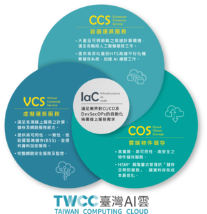

###### tags: `twcc`, `twccli`

# TWCC-CLI Project

The [TWCC, Taiwan Computing Cloud](https://www.twcc.ai) Command Line Interface (CLI) is an environment to create and manage your TWCC services.

[](https://sonarcloud.io/dashboard?id=twcc_TWCC-CLI)

[](https://circleci.com/gh/twcc/TWCC-CLI) [](https://gitter.im/TWCC-CLI/community?utm_source=badge&utm_medium=badge&utm_campaign=pr-badge&utm_content=badge) [](https://twcc-cli.readthedocs.io/en/latest/?badge=latest) [User Manual](https://man.twcc.ai/@twccdocs/twcc-cli-v05)

The TWCC Command Line Interface (CLI) is an environment to create and manage your TWCC resources. 



If you have any questions, please email us at: iservice@twcc.ai for account support, and isupport@twcc.ai for technical support

 ❗ ❗ Always try to upgrade your TWCC-CLI by using `pip3 install -U TWCC-CLI`. ❗ ❗ ❗


## :point_down: Release Notes :point_down:

### v0.5.21 Release Note


**Feature**
- Users can protect your sites from not expected remove, check out `-keep` while `twcc ch [ccs|vcs]`.
- Enable VCS reboot, check out `-sts Reboot` while `twccli ch vcs`

**Bug Fix**
- fix ValueError: APIKEY is not validated, while `config init` , related [#34](https://github.com/twcc/TWCC-CLI/issues/34)
- fix some bugs

### v0.5.20 Release Note


**Feature**
- Users can pass any command to your CCS by using `-cmd` or `--command` right after it right after your CCS ready

**Bug Fix**
- fix some bugs while using vcs

### v0.5.19 Release Note


**Feature**
- Users can use `-ptype` to create customized CCS.
- Users can transport your credentials to your new resources. You can switch off by providing `-nokey` while `twcc mk [ccs|vcs]`.

**Bug Fix**
- fix auto migrating bugs
- fix typo error
- fix some bugs

### v0.5.18 Release Note


**Feature**
- We support auto-complete for TWCC-CLI :sparkles::sparkles:
- We support Python 3.9 :sparkles:
- We enable environment parameters in CCS

**Bug Fix**
- fix some bugs

### v0.5.17 Release Note


**Feature**
- We add sonarqube for better software quality.
- VCS `snapshot` be renamed to `custom-image` in TWCC.
- BSS(block storage service) has been renamed to [VDS(virtual disk service)](https://man.twcc.ai/@twccdocs/r1DhqHdpN) in TWCC.
- Enable envoronment variables for VCS, check out `twccli mk vcs -h`.

**Bug Fix**
- fix bug in `mk key`
- fix bug in `ls -itype`
- fix exception bug
- Update AIML Pipeline scripts.

### v0.5.16.2 Release Note

**Feature**
- Users can create VCS with windows img

**Bug Fix**
- fix some bugs

### v0.5.16.1 Release Note

**Bug Fix**
- fix some bugs

### v0.5.16 Release Note


**Feature**
- CLI is now collected users operating information by GA. If you don't want to be collect, just keep your `ga_cid` value **EMPTY** in `$HOME/.twcc_data/credential`.
- Users can turn on/off COS bucket version control feature and create public access URL for specific objects.
- Users can checkout [HFS](https://man.twcc.ai/@twccdocs/rypYCr_TN) info with CLI
- Users can list CCS log, and show more information.
- CLI now can renew your credential file automatically, keep it up-to-date.

**Bug Fix**
- fix bug in `net vcs`

### v0.5.15 Release Note


**Feature**
- BSS(Block Storage Service) is officially renamed as VDS(Virtual Disk Service).
- Users can list personal resource of VDS & [VLB](https://www.twcc.ai/doc?page=load_balancer).
- Users can create multi listener over [VLB](https://www.twcc.ai/doc?page=load_balancer).
- Users can change VCS descrption with `-d`.
- Users can multiply name their SnapShot wile createing.

**Bug Fix**
- fix #9
- fix timezone problem
- fix error response for snapshot

### v0.5.14 Release Note


**Feature**

- Users can operate volumn in [VCS](https://www.twcc.ai/doc?page=vm).
- We let `-s` support multiple site-id.
- New progress bar for [COS](https://www.twcc.ai/doc?page=object) operations.

**Preview**
- Users can operate [Vertual Network](https://www.twcc.ai/doc?page=virtual_network) (Tenant Administrator Only) and [Load Balancer](https://www.twcc.ai/doc?page=load_balancer).

**Bug Fix**
- fix unicode error, [BSS](https://www.twcc.ai/doc?page=volume) & [VCS](https://www.twcc.ai/doc?page=vm) status problems.

### v0.5.13 Release Note


**feature**
- We release a sample AI/ML pipeline task, here. Join us for understand how to use by attending TWCC classes, https://www.nchc.org.tw/Active/ActiveView/414?mid=47&page=1
- Users can create TWCC-VCS with default ubuntu 20.04
- Users can set a specified range of port for secuity group at one time.
- Multi users profile compatible.


**fix bug**
- fix typo error 
- fix download error for none-file folder bucket
- `ls ccs -json` shows empty table when ccs empty

### v0.5.12 Release Note


**feature**
- We design TWCC_VCS module for ansible.


**issue**
- We fix #7 

**fix bug**
- fix COS command line problems.

### v0.5.11 Release Note


**change**
- In v0.5.10, we use `--product-type` in wrong place, that has been correct.
- We change `cp cos` command structures, new command  descriptions as following:
```bash=
> twccli cp cos --help
Usage: twccli cp cos [OPTIONS]

  ‘Upload/Download’ COS (Cloud Object Storage) files.

Options:
  -upload                   Upload files or folders to the bucket.
  -download                 Download files from the bucket or download the
                            entire bucket.
  -src, --source TEXT       Path of the source directory.
  -okey, --object-key TEXT  File in Cloud.
  -fn, --file-name TEXT     Files for uploading from local site.
  -bkt, --bucket-name TEXT  Upload files or folders to the bucket.
  --help                    Show this message and exit.

```

**discuss**
- We are trying to laverage [Ansible](https://www.ansible.com/) for deloying any services. 
Do you have any suggestions to this? 
Welcome to [leave comments](https://github.com/TW-NCHC/TWCC-CLI/issues/new!!


 
### v0.5.10 Release Note


**change**
- VCS images showing table shows "product-type" now!

### v0.5.9 Release Note


**change**
- orginal `-itype` in `ls vcs` and `mk vcs` change to using `-ptype` and `--product-type`.

**fix bug**
- error in `rm vcs -secg` and `ls vcs -img` with filtering.
- error in `cp cos -upload` , `cp cos -download` and `rm cos` bucket.


### v0.5.7 Release Note


** We have updated our document in [TWCC-CLI α for v0.5](https://man.twcc.ai/@twccdocs/twcc-cli-v05)


**fix bug**
- fix bugs in COS and data-vol-type while creating VCS.

### v0.5.6 Release Note


**new features**
- You can create additional data volume in `ssd` and `ssd-encrypt` type.

**fix bug**
- upload file source path with slash is not work.
- adding error condition in `rm ccs -s` while entering resource name, and adding `-s` parameter in `ls ccs`.
- fix naming standard to 6-16 in length.
- support customized clone image in CCS.

### v0.5.5 Release Note


**new features**
- snapshot delete functions, `twccli rm vsc -snap -snap-id $SNAPTSHOT_ID`

**fix bug**
- delete bucket and file operation
- upload and download dir to bucket
- remove flag 'noforce' in `twccli rm`
- update listing all snapshots for Project Owner
- `rm vcs` with `-s` flag

### v0.5.4 Release Note


**new features**
- provides encoding setting, `twccli config init --set-bashrc`

**fix bug**
- no data while listing VCS 
- can't delete bucket with data recursively
- can't download hierarchy directory to local site 
- modify parameter and description in command "CP"

### v0.5.3 Release Note


**new features**
- We add encoding environ setting
- add keypair write and del file
- add private ip and network info while ls vcs

**fix**
- fix create keypair's bug
- fix error in `MANIFEST.in`, remove vcs cos, list vcs, --help description of cos


### v0.5.2 Release Note
**New and structured CLI commands!**

for Mar. 20th ,2020 (v0.5.2)
  - Now you can use structured commands`config`, `mk`, `ls`, `rm`, `cp`, and `net` to customize and manage your TWCC Compute and Storage services, including VCS, CCS, and COS.
  - In addition to CCS and COS, now you can use TWCC CLI to manage your VCS resources, including VCS instances, security groups, snapshots, as well as keypairs.
  - Use commands`-table` or `-json show` to clearly diaplay your resource information in a table view or in JSON.


## Contact us
If you have any questions, please email us at: 
- iservice@narlabs.org.tw for account support
- isupport@narlabs.org.tw for technical support


 | 
